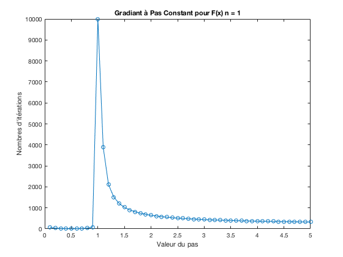
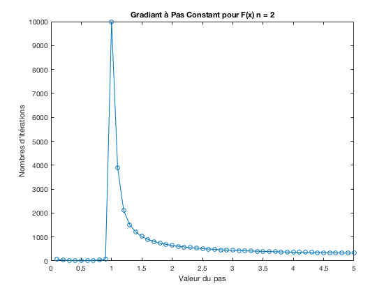
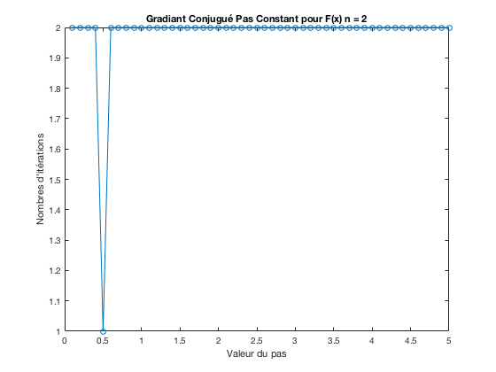
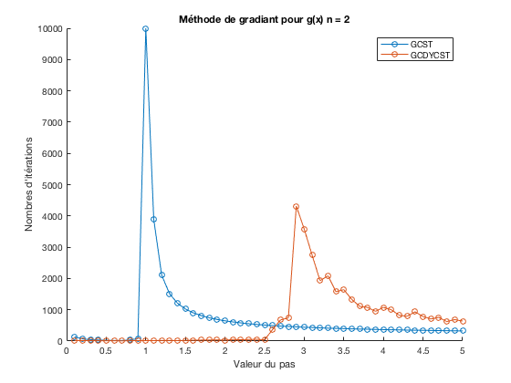
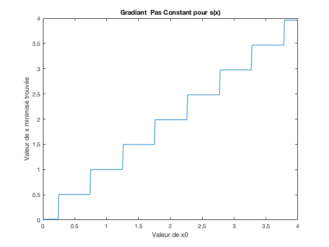
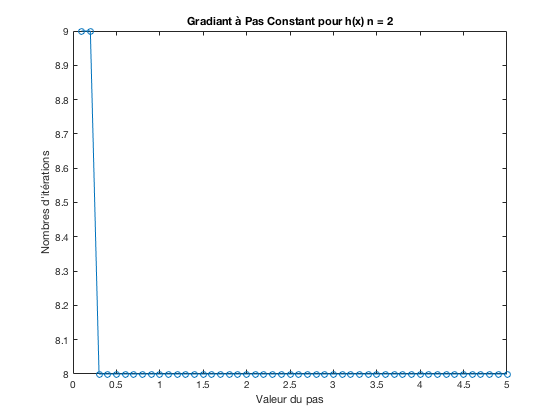
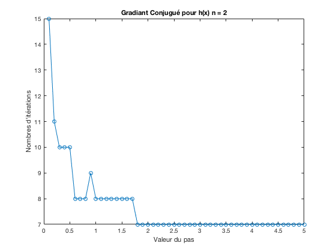

# TP n°1: Optimisation

##  Exercice 1 *(Méthodes à pas constant)*

### 1) Gradiant à pas constant

La fonction `GCST()` est implémentée dans le fichier `GCST.m`

### 2) Application à f(x) pour n=1 et n=2.

Le script `q1_2.m` effectue l'application de la méthode du gradiant à pas constant à la fonction $f()$ pour $n=1$.

Nous obtenons les courbes suivantes: 

- Tout d'abord la courbe représentant le nombre d'itérations effectuées avant que la fonction `GCST()` ne retourne.

Nous distinguons trois parties dans ce graphe:

1. Pour `pas`$\in [0.1, 1[$ la méthode converge rapidement
2. Pour `pas` $= 1$, la fonction `GCST()`retourne au bout du maximum d'itération permises sans avoir convergé.
3. Pour `pas` $> 1​$, la méthode parait converger. Cependant un examen plus attentif montre que les valeurs retournées pour `x`  et `Jx` sont en fait égales à `NaN`. La méthode de gradient à pas constant a dans ce cas  retourné sans avoir convergé. Les valeurs calculées ont divergé jusqu'à entrer dans des valeurs non supportées par le système.

Le script `script1_2.m` effectue le même calcul sur la fonction $f()$ pour $n=2$.

Nous obtenons le graphe suivant: 

Nous constatons que la courbe est identique pour $n=1$ et $n=2$.

<!--Ajouter bafouille de pourquoi c'est le cas - voir de TD.-->

### 3) Gradient conjugué à pas constant

#### Pour $f$ avec $n=1$:

Le script `script1_3.m` applique la méthode de gradient conjugué de Dai-Yuan à pas constant sur la fonction $f$ pour $n=1$. Le résultat est le suivant:

Pour $f$ avec $n=2$:

Le script `script1_4.m` applique la même méthode de gradient conjugé à pas constant sur la fonction $f$ pour $n = 2$. Le résultat est le suivant:

### 4) Méthodes de gradients avec g(x)

Le script `script1_5.m` applique la méthode des gradients à pas constants (`GCST`)  et la méthodes des gradients conjugués (`GCDYCST`) pour $g(x)$ avec $n=2$.

### 5) Méthode de gradient avec s(x)

Le script `script1_6.m` effectue le calcul sur $s(x)$ :

## Exercice 2: Méthodes à pas optimal

### 1) Ecrire les fonctions qui calculent le minimum des fonctions f et g par les méthodes du gradient conjugué à pas optimal.

#### Pas optimal pour $f(x)$

Pour $f(x)$ et à partir de la méthode du gradient à pas constant, nous cherchons le pas optimal en cherchant le $\rho_k$ qui minimise $f(x^{(k)}-\rho d^{(k)})$, soit
$$
\rho_{k} = \underset{\rho}{argmin}\left(f\left(x^{(k)}-\rho \: d^{(k)})\right)\right)
$$
En posant $\varphi(\rho) = f\left(x^{(k)}-\rho \: d^{(k)}\right)$, nous pouvons développer:
$$
\begin{align}
\varphi(\rho)  & = \sum_{i=1}^{n}\left(x_i^{(k)} + \rho \: d_i^{(k)} - i \right)^2 \\
& = \sum_{i=1}^{n}\left(x_i^{(k)}  - i + \rho \: d_i^{(k)}\right)^2 \\
& = \sum_{i=1}^{n}\left((x_i^{(k)}  - i )^2 + 2\rho \: d_i^{(k)}(x_i^{(k)}  - i) + \rho^2d_i^{(k)2}\right) \\
& = \sum_{i=1}^{n}(x_i^{(k)}  - i )^2 + \rho\sum_{i=1}^{n} 2\: d_i^{(k)}(x_i^{(k)}  - i)+ \rho^2\sum_{i=1}^{n}d_i^{(k)2} \\
& = f(x^{(k)}) + \rho \: d^{(k)}.\nabla f(x^{(k)}) + \rho^2 d^{(k)2}

\end{align}
$$
En posant:
$$
\begin{align}
A = f(x^{(k)}) , &&
B = d^{(k)}.\nabla f(x^{(k)}), &&
C = d^{(k)2}
\end{align}
$$
nous obtenons $\varphi(\rho) = A + \rho B + \rho^2 C$.

Pour trouver $\rho_{k} = \underset{\rho}{argmin}(\varphi(\rho))$, nous devons dériver $\varphi(\rho)$ et rechercher le $\rho$ qui annule $\varphi'(\rho)$:
$$
\begin{align}
\varphi'(\rho_k)=0 &&\Longleftrightarrow && B + \rho_k 2C = 0 && \Longleftrightarrow && \rho_k=-\frac{B}{2C}
 \end{align}
$$
#### Cas de la méthode des gradients à pas constant

Dans le cas de la méthode des gradients à pas constant nous avons:
$$
d^{(k)} = - \nabla f(x^{(k)})
$$
donc
$$
\begin{align}
&B = -(\nabla f(x^{(k)}))^2, && C = (-\nabla f(x^{(k)}))^2 = -B \\
&\Longrightarrow \rho_k = -\frac{B}{-2B} = \frac{1}{2} = \rho
\end{align}
$$
Cela veut dire que le pas optimal pour $f(x)$ est constant et égal à $\frac{1}{2}$, $\forall n \in \mathbb{N}^*$.

#### Pas optimal pour $g(x)$

Pour $g(x)$ et à partir de la méthode du gradient à pas constant, nous cherchons le pas optimal en cherchant le $\rho_k$ qui minimise $g(x^{(k)}-\rho d^{(k)})$, soit
$$
\rho_{k} = \underset{\rho}{argmin}\left(g\left(x^{(k)}-\rho \: d^{(k)})\right)\right)
$$
En posant $\varphi(\rho) = g\left(x^{(k)}-\rho \: d^{(k)}\right)$, nous pouvons développer:
$$
\begin{align}
\varphi(\rho)  & =  \sum_{i=1}^{n} \frac{1}{i}\left(x_i^{(k)} + \rho \: d_i^{(k)} - i \right)^2 \\
& = \sum_{i=1}^{n} \frac{1}{i}\left(x_i^{(k)}  - i + \rho \: d_i^{(k)}\right)^2 \\
& = \sum_{i=1}^{n}\frac{1}{i}\left((x_i^{(k)}  - i )^2 + 2\rho \: d_i^{(k)}(x_i^{(k)}  - i) + \rho^2d_i^{(k)2}\right) \\
& = \sum_{i=1}^{n}\frac{1}{i}(x_i^{(k)}  - i )^2 + \rho\sum_{i=1}^{n} \frac{2}{i}\: d_i^{(k)}(x_i^{(k)}  - i)+ \rho^2\sum_{i=1}^{n}\frac{1}{i}d_i^{(k)2} \\
& = g(x^{(k)}) + \rho \: d^{(k)}.\nabla g(x^{(k)}) + \rho^2 \sum_{i=1}^{n} \frac{2}{i}\: d_i^{(k)}

\end{align}
$$
En posant:
$$
\begin{align}
A = g(x^{(k)}) , &&
B = d^{(k)}.\nabla g(x^{(k)}), &&
C = \sum_{i=1}^{n} \frac{d_i^{(k)} }{i}
\end{align}
$$
nous obtenons $\varphi(\rho) = A + \rho B + \rho^2 C​$.

Pour trouver $\rho_{k} = \underset{\rho}{argmin}(\varphi(\rho))$, nous devons dériver $\varphi(\rho)$ et rechercher le $\rho$ qui annule $\varphi'(\rho)$:
$$
\begin{align}
\varphi'(\rho_k)=0 &&\Longleftrightarrow && B + \rho_k 2C = 0 && \Longleftrightarrow && \rho_k=-\frac{B}{2C}
 \end{align}
$$

#### Cas de la méthode des gradients à pas constant

Dans le cas de la méthode des gradients à pas constant nous avons:
$$
d^{(k)} = - \nabla g(x^{(k)})
$$
donc
$$
\begin{align}
&B = -(\nabla g(x^{(k)}))^2, && C = (-\nabla g(x^{(k)}))^2 = -B \\
&\Longrightarrow \rho_k = -\frac{B}{-2B} = \frac{1}{2} = \rho
\end{align}
$$
Cela veut dire que le pas optimal pour $g(x)$ est aussi constant et égal à $\frac{1}{2}$, $\forall n \in \mathbb{N}^*$.

#### Applications

Le script `script2_1.m` effectue la méthode des gradients pas optimal.

Le script `script2_2.m` effectue la méthode des gradients conjugués à pas optimal.h

Le script `script2_3.m` effectue la comparaison des différentes méthodes pour $g(x)$ en $n=2$.

## Exercice 3:

Pas eu le temps.

## Exercice 4: Etude numérique de la fonction de Rensenbrock

Nous tentons d'utiliser les méthodes utilisées précédemment pour minimiser la fonction de Rozenbrock.

Nous savons que le minimum de cette fonction est situé en $(x1,x2)=(1,1)$ et que $h(1,1)=0$.

Le script `q4_1.m` utilise la méthode du gradient à pas constant. Nous nous plaçons donc dans le voisinage de ce minimum en prenant pour $x0 = (1.0001, 1)$ et nous faisons varier le pas.

Le résultat de cette méthode est indiqué ci-dessous.

Nous constatons que cette méthode diverge dans tous les cas et très rapidement.

Le script `q4_2.m` utilise la méthode de gradient conjugué de Day-Yuan, dans des conditions initiales similaires à précédemment.

